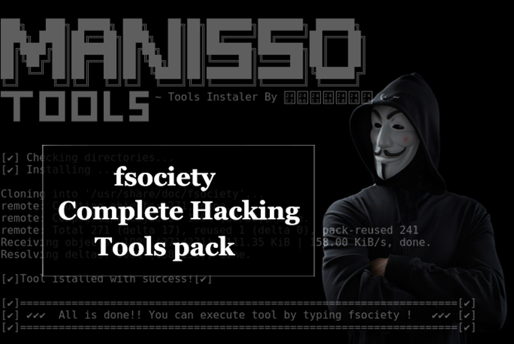

**Penetration Testing** also known as **Ethical Hacking** is the practice of testing a computer system, network or web application to find security vulnerabilities that an attacker could exploit. It can either be automated with software applications or performed manually.

**FSociety** is an open source penetration testing framework that consists of a variety of hacking tools which range from information gathering to post-exploitation.

If you are passionate about cyber security, you must have heard of the famous _Mr Robot_ series. Fsociety is a framework that has been used in the series to carry out the various hacking attacks featured in the series. I don’t want to give you any spoilers but for those who have not watched this TV show, I would highly recommend it.

**Advantages of Fsociety framework.**

1) It comes with a complete tool set for all the penetration testing stages.

2) It can be used in platforms such as Windows, Linux and Android.

3) It is super easy to get started.

4) It is automated, It therefore gets you a moment to sip over a cup of tea.

## Getting started with Fsociety

### **Steps on how to install and get started with Fsociety:**

FSOCIETY can be cloned from github [https://github.com/Manisso/fsociety](https://github.com/Manisso/fsociety).

1. To clone from github run

**git clone** [**https://github.com/Manisso/fsociety.git**](https://github.com/Manisso/fsociety.git)

1. Navigate to the directory where you have cloned fsociety.
2. Provide executable permission on install.sh by running this command on the terminal

**chmod +x install.sh**

1. Finally execute

**./install.sh** to install

1. To run just type :

**fsociety**

The following screen will appear:

You can now use tools from each category above by typing in the number of the type of attack you want to use. These include:

● Information Gathering

● Password Attacks

● Wireless Testing

● Exploitation Tools

● Sniffing & Spoofing

● Web Hacking

● Private Web Hacking

Let me briefly point out some of the tools Mentioned above.

## 1\. Information Gathering

This is the first and most important phase of any penetration testing. The pen tester gathers all the publicly available information about their target and seeks ways in which they can be exploited.

Fsociety covers the following tools for information gathering:

● Nmap

● Setoolkit

● Host To IP

● WPScan

● CMS Scanner

● XSStrike

● Dork — Google Dorks Passive Vulnerability Auditor

● Scan A server’s Users

● Crips

So, what next after getting the user information? I would try to attack the passwords and Fsociety got us covered at number 2.

## 2\. Password Attacks

For password attack, Fsociety uses:

● Cupp: (Common User **Passwords** Profiler), is tool to generate wordlist from common user profiler.

● Ncrack

In case we wish to attack the system from the wireless side, we can test the target’s wireless infrastructure using Tools provided for us in number 3.

## 3\. Wireless Testing

For wireless testing, the following tools are available:

● Reaver

● Pixiewps

● Bluetooth Honeypot

After testing the target’s wireless infrastructure, we then move to the fun part, where we attempt to exploit and take advantage of the target’s system. Luckily enough, Fsociety got us covered on that too at number 4.

## 4\. Exploitation Tools

These are the tools That will allow you to take advantage of the vulnerabilities You discovered. The following tools are provided to help you with that task:

● ATSCAN

● sqlmap

● Shellnoob

● Commix

● FTP Auto Bypass

● JBoss Autopwn

Once we succeed or even if we don’t, we can try sniffing and spoofing to get what we want using our number 5.

## 5\. Sniffing and Spoofing

Just to note**: Spoofing** and **Sniffing** are types of cyber-attacks. In simple words, **Spoofing** means to pretend to be someone else. **Sniffing** means to illegally listen into another’s conversation.

The tools used for sniffing and spoofing in Fsociety are:

● Setoolkit

● SSLtrip

● pyPISHER

● SMTP Mailer

If our entry point happens to be the web, we have tools to help us with this at number 6 and 7.

## 6\. Web Hacking

It consists of tools used for web penetration testing and also CMS (Content Management System).

Tools available include:

● Drupal Hacking

● Inurlbr

● Wordpress & Joomla Scanner

● Gravity Form Scanner

● File Upload Checker

● Wordpress Exploit Scanner

● Wordpress Plugins Scanner

● Shell and Directory Finder

● Joomla! 1.5–3.4.5 remote code execution

● Vbulletin 5.X remote code execution

● BruteX — Automatically brute force all services running on a target

● Arachni — Web Application Security Scanner Framework

## 7\. Private Web Hacking

Under private web hacking the following tools are available:

● Get all websites

● Get joomla websites

● Get wordpress websites

● Control Panel Finder

● Zip Files Finder

● Upload File Finder

● Get server users

● SQli Scanner

● Ports Scan (range of ports)

● Ports Scan (common ports)

● Get server Info

● Bypass Cloudflare

We are also provided with some post-exploitation tools as an option at number 8.

## 8\. Post Exploitation

The following are tools available for post exploitation:

● Shell Checker

● POET

● Weeman

Thank you for stopping by.

> **DISCLAIMER:** This article is for learning purposes only. I am not responsible for any harm caused while referring to it.

_Article by Restercuter Nyawira, a SheHacks KE member, trainer and cybersecurity enthusiast. Find her on LinkedIn (_[_Restercuter Nyawira_](https://www.linkedin.com/in/restercuternyawira/)_) and Twitter @Restercuter1._
