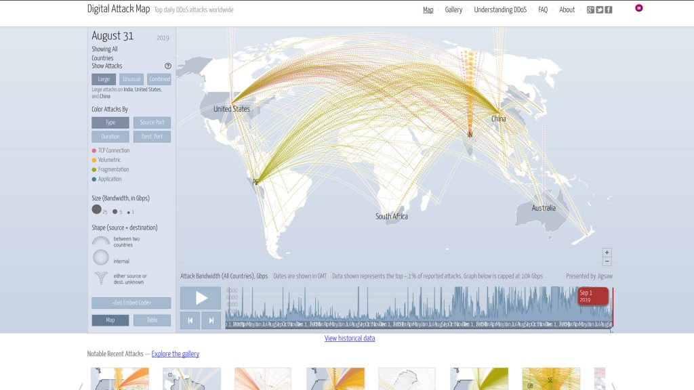
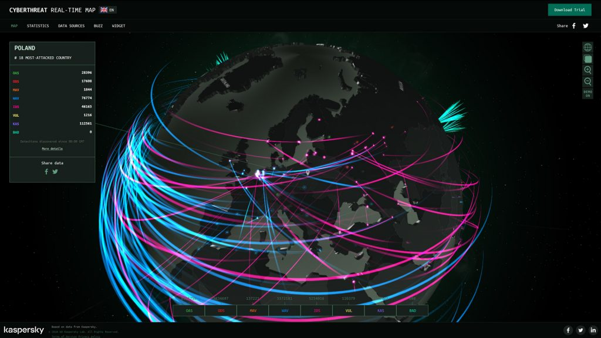
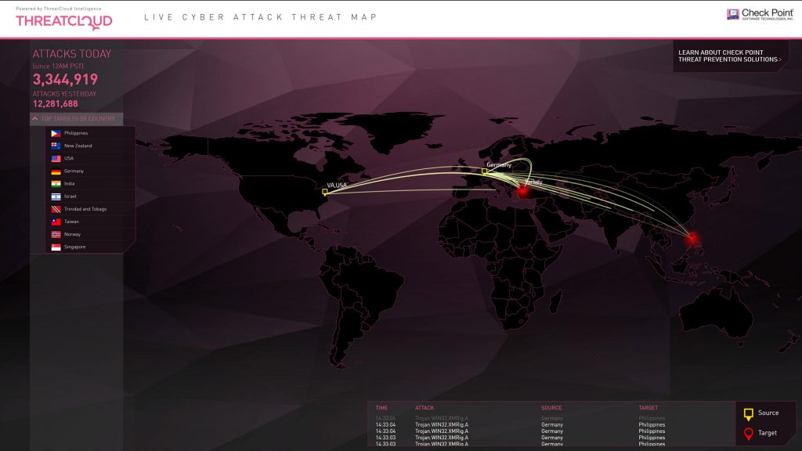
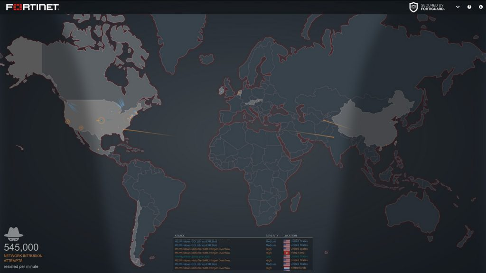
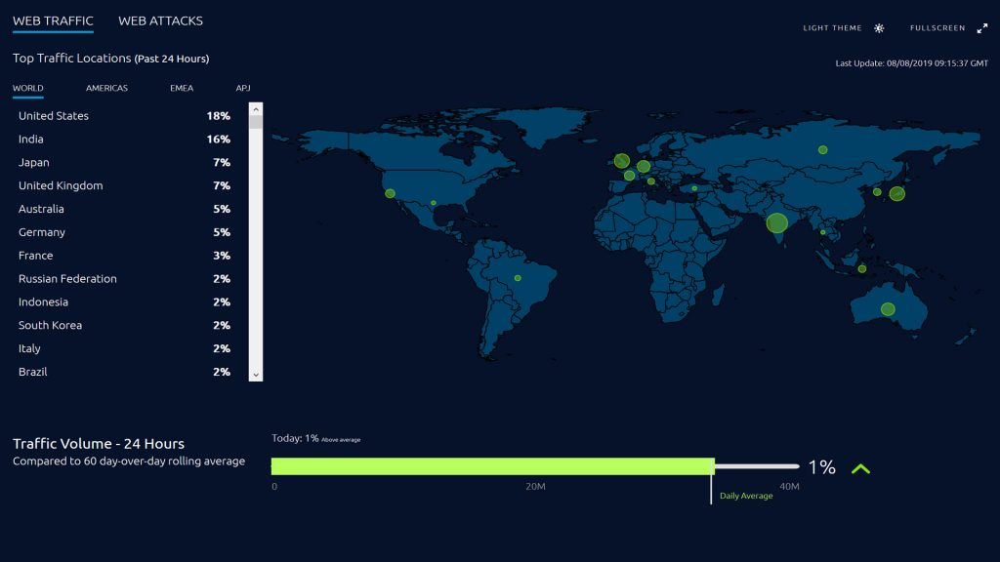
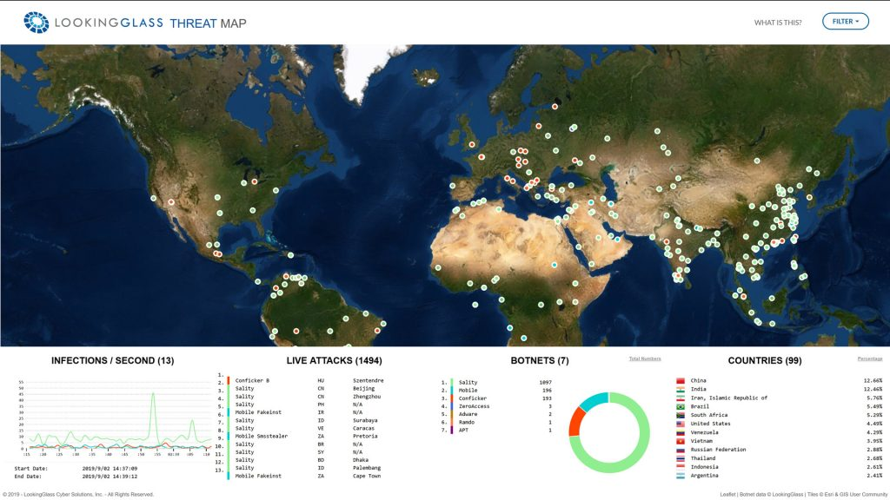
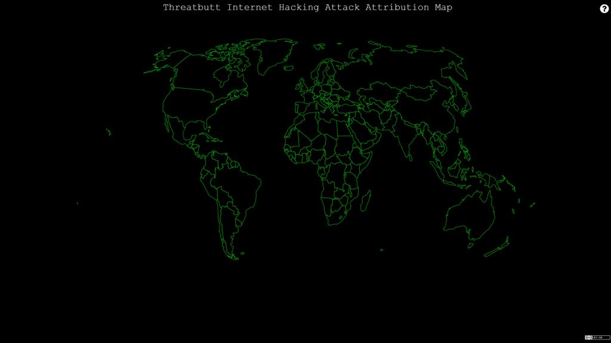
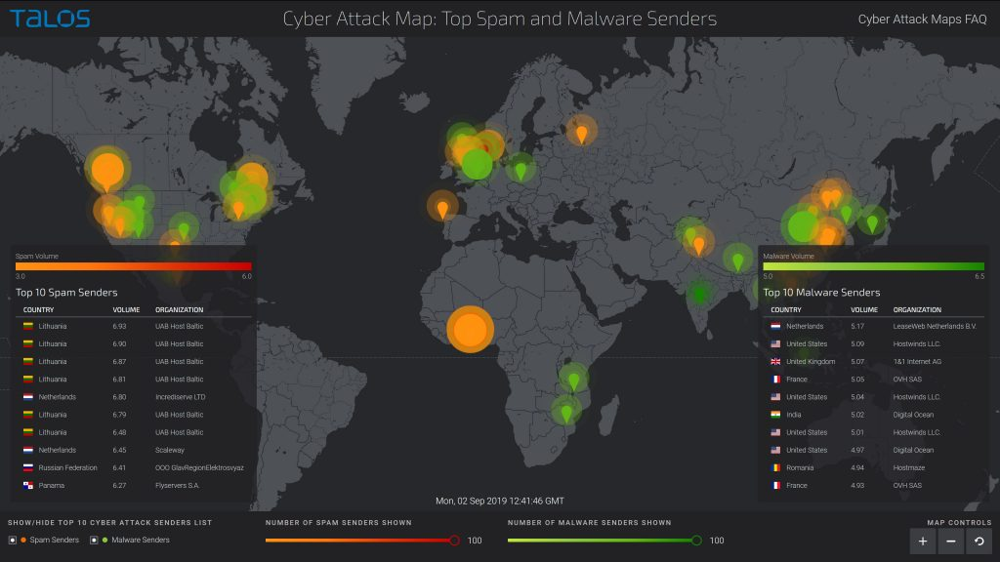

## What is a DDoS Attack?

First, we must define the meaning of a DDoS attack. DDoS attacks are a main concern in internet security, and many people misunderstand what exactly they are.

A Distributed Denial of Service (DDoS) attack is a malicious attempt to upset typical internet traffic of a targeted server by overwhelming it with traffic from multiple sources. DDoS attacks target a plethora of important resources, from banks to news websites, and present a major challenge to making sure Internet users can publish and access important information. A DDoS attack is similar to a traffic jam on a highway, preventing typical traffic flow.

## How does a DDoS attack work?

A DDoS attack requires the attacker to gain control of a network of online machines. Computers are infected with malware, turning them into a bot. Then, the attacker has control over the group of bots, now called a botnet.

Once a botnet is established, the attacker will send instructions to each bot from a remote control. Once the IP address is targeted, each bot will respond by sending requests to the target, causing the server to overflow, which will result in a DDoS attack.

## How can you combat DDoS attacks?

If you are facing an isolated low- to mid-size Distributed Denial of Service (DDoS) attack, you can explore these logs and find the information you need to protect yourself from these attacks. However, with larger attacks, manual lookups are time consuming and ineffective. That’s why there need to be other plans in place to fight cyber-attacks.

However, if you are not experiencing a DDoS attack, and you just want to learn about top digital attack information from cybersecurity incidents around the world, where would you look? You can try internet service provider (ISP)’s stats or check out anti-DDOS providers, or you can see what’s happening right now by looking at digital attack maps.

To see how cybersecurity works globally, you can observe cyber-attacks and how malicious packets interact between countries. We are going to share with you the top cyber-attack maps that you can watch in order to visualize digital threat incidents.

## Global Cyber Attacks Today

Today, cyber-attacks can affect anyone, but some of them are designed to leave global damage. A cyber-attack is any type of internet attack designed by individuals or entire organizations that targets computer information systems, networks, or infrastructures. When they appear, they come from a seemingly anonymous source that will attempt to destroy its victim through hacking into its system.

There have been many, many worldwide cyber-attacks, and some are happening right now. The [latest statistics](https://www.accenture.com/us-en/insights/security/cost-cybercrime-study) say that security breaches have increased by 11% since 2018 and 67% since 2014. In fact, hackers attack [every 39 seconds](https://eng.umd.edu/news/story/study-hackers-attack-every-39-seconds), so on average, 2,244 times a day.

## **What is a Cyber Attack Map?**

Cyber-attack maps are valuable tools that give information on how to stay ahead of attacks. A cyber-attack map shows how the Internet functions in a graphical way and can be useful to see the big picture. Even though we’re talking about enormous amounts of damage that cybercriminals cause, the maps themselves can be fascinating to watch.

Every 39 seconds, a cyber-attack occurs. While some of these are manually-targeted cyber-attacks, most of them are botnets steadfast on shutting down infrastructures and destroying computers and systems of major organizations.

A DDoS attack map is a type of cyber-attack map that details just DDoS attacks.

Most current digital attack maps share these specifics:

- They are incorrectly advertised as “live maps”—most do not show live attack data, but records of past attacks.
- They only show Distributed Denial of Service (DDoS) attack, not other types of cybercrime.
- They only display anonymous traffic data.

Because most cyber-attack maps are not in real-time, it can be difficult to understand them. However, there are still positives to these maps.

## **Is it Useful to Understand Cyber Attack Maps?**

The jury is still out on whether it is actually beneficial to understand cyber-attack maps and how they function.

Some Information Security industry experts claim that these maps aren’t useful at all, that they’re simply used as a sales tool by cybersecurity solution providers.

However, other experts believe that while these threat maps have no practical usage for mitigating attacks, threat maps can be used to study past attack styles, to recognize raw data behind DDoS attacks, or to even report outages on certain dates and times to their customer base.

Another essential point to keep in mind about the source of the attacks: even though these maps pinpoint particular countries launching attacks against others, that doesn’t mean the actual source of the attack is the same as the attacker location.

In actuality, the source of an attack is often forged, which means that it appears as though it was initiated from a certain country, but it is not from that country at all. When the map shows the correct location, it’s often not the real attacker behind the cyber-attack, but rather an infected computer working for a botnet.

Another noteworthy fact is that the largest attacks usually originate from high bandwidth nations, who are perfectly suited to launching huge attacks from thousands of infected devices led from more isolated locations.

One more important point to note is that while these maps provide valuable cyber-attack information, it is impossible to fully map all digital attacks online because they are constantly changing. These maps update regularly (usually hourly, but some are in real time), but they cannot show everything.

## **The Most Popular Cyber Attack Maps**

### **1\. Arbor Networks DDoS Attack Map**

[**Arbor Networks**](https://www.digitalattackmap.com/) is one of the most popular attack maps. This map is devoted to tracking down attack episodes related to DDoS attacks around the world.

Arbor Networks ATLAS® global threat intelligence system has gathered and presented the data, which comes from a worldwide analysis of 300+ ISPs with over 130 Tbps of live traffic. This map’s stats are updated hourly, but the digital map also allows you to explore historical data sets.

Its features include:

- Stats for each country

- The attack source and destination
- Various types of attacks (large, uncommon, combined, etc)
- Color-coded attacks by type, source port, duration and destination port
- The size of the DDoS attack in Gbps
- The embed code so you can attach the map in your own website
- Sort by TCP connection, volumetric, fragmentation and application

### 2\. Kaspersky Cyber Malware and DDoS Real-Time Map

The **[Kaspersky](https://cybermap.kaspersky.com/) cyber threat map** is one of the most comprehensive maps available, and it also serves as the best when it comes to graphical interface. It also _looks_ amazingly sleek, although of course, what it signifies is Internet devastation.

When you open the map, it detects your current location and displays stats for your country, also including top local attacks and infections from the past week.

Here are the activities detected by the cybermap Kaspersky:

- On-Access Scan
- On-Demand Scan
- Mail Anti-Virus
- Web Anti-Virus
- Intrusion Detection Scan
- Vulnerability Scan
- Kaspersky Anti-Spam
- Botnet Activity Detection

Here are some other features this map offers:

- Switch to globe view
- Toggle map color
- Zoom in/out
- Enable/disable demo mode
- Embed map using iframe
- Buzz tap which includes helpful articles

### 3\. ThreatCoud Live Cyber Attack Threat map

CheckPoint designed the [**ThreatCloud**](https://threatmap.checkpoint.com/ThreatPortal/livemap.html) **map**, which is another cyber-attack map offering a hi-tech way to detect DDoS attacks from around the globe. It’s not the most advanced map in our list, but it does succeed in showing live stats for recent attacks.

ThreatCloud displays live stats, which include new attacks, the source of the attacks, and their various destinations. Another interesting feature is the “Top targets by country” feature, which offers threat stats for the past week and month, as well as the average infection rate and percentage of most frequent attack sources for some countries.

At the time of this writing, the Philippines was the top country attacked, with the United States in second.

### 4\. Fortinet Threat Map

The **[Fortinet](https://threatmap.fortiguard.com/) Threat Map** features malicious network activity within various geographic regions.. In addition, this attack map will display various international sources of attack and their destinations. It may not be as visually exciting as some of the others, but it is easy to understand.

General live attack activity will be shown in order of attack type, severity and geographic location. You can also see a day/night map under the attack map which is interesting.

If you click on a country name, you will see statistics for incoming and outgoing attacks, as well as overall activity in the country. The different colors on the map represent the type of attack, for example:

- Execution (remote execution attacks)
- Memory (memory-related attacks)
- Link (Attack from a remote location)
- DoS (Denial of Service attacks)
- Generic attacks

Another feature of the Fortinet Threat Map is the ongoing statistics on the bottom left hand corner of the page. For example, number of Botnet C&C attempts per minute and number of malware programs utilized per minute.

### 5\. Akamai Real-Time Web Attack Monitor

Another great attack visualization map is **[Akamai](https://www.akamai.com/es/es/resources/visualizing-akamai/real-time-web-monitor.jsp?tab=attacks&theme=dark) Real-Time Web Attack Monitor**.

This company controls a big portion of today’s global internet traffic. With the vast amounts of data it gathers, it offers real-time stats pinpointing the sources of most of the biggest attacks anywhere around the globe.

It also cites the top attack locations for the past 24 hours, letting you choose between different regions of the world.

This map is displayed in various languages. You can change the language by clicking on the language tab on the top right corner of the page. This map also includes helpful learning resources such as a glossary and a library.

### **6\. LookingGlass Phishing/Malicious URL Map**

The **[LookingGlass](https://map.lookingglasscyber.com/) real-time map** shows actual data from Looking Glass threat intelligence feeds, including:

- Cyveillance Infection Records Data Feed
- Cyveillance Malicious URL Data Feed
- Cyveillance Phishing URL Data Feed

The goal is this map is to detect and show live activity for infected malicious and [phishing domain](https://securitytrails.com/blog/finding-phishing-domains) URLs. When you load the map, the results will be shown in four columns which include infections per second, live attacks, botnets involved, and the total number of affected countries.

When you click on any location on the map, you will see additional details about the malicious incident, such as time, ASN, organization, and country code.

You can also filter the display options using the “filter” tab in the upper right-hand corner of the webpage.

### 7\. Threat Butt Hacking Attack Map

[**Threat Butt**](https://threatbutt.com/map/) features one of the coolest looking digital attack maps around, not because of a wide range of features, but because of its retro design.

The map is displayed in a basic black and green design, with red lines which extend to countries where attacks are detected. In the footer you’ll see descriptive information about each attack, including origin country, IP address, destination, and even some humorous captions.

This map is one that is appealing to explore. We know cybercrime is no laughing matter, but the makers of Threat Butt certainly have a sense of humor.

### 8\. Talos Spam and Malware Map

Another company offering a **free digital attack map is [Talos](https://talosintelligence.com/fullpage_maps/pulse)**. The threats displayed on this map are detected by Talos attack sensors, as well as culled from third party feeds. The information displayed is completely dedicated to revealing the world’s top spam and malware senders.

Talos Spam and Malware Map displays the top 10 cyber-attack sender lists by country as well as by top malware senders.

To see more information about these senders, such as the exact IP address of the server that sent the spam/malware, hostname, the last day of the detection, and the reputation status, you can click on their names.

Also, when you click the hostname, you will see information about the network owner, as well as reputation details, email volume average and volume change.

### **9\. Sophos Threat Tracking Map**

The **[Sophos](https://www.sophos.com/en-us/threat-center/threat-monitoring/threatdashboard.aspx) map is not a real-time map, but a static threat tracking map.** Its data comes from SophosLabs monitoring and malware research activities.

Threats are visualized by three central graphics:

- Today’s Malicious Web Requests
- Today’s Blocked Malware
- Today’s Web Threats

At the bottom of the page, you will see a Threat Geography map which allows you to click on any affected location to find out more details about spam issues. Examples include:

- Infected websites (including the malware/virus name).
- Spam source (including subject, source IP and exact location)
- Email malware source (including subject, source IP and exact location)

### 10\. FireEye Cyber Threat Map

The **[FireEye](https://www.fireeye.com/cyber-map/threat-map.html) Cyber Threat Map** is still informational, but it does not contain many of the features that the others do. It does, however, show the origin, the destination, the total number of attacks, as well as some other stats about the previous 30 days, such as top attacker countries and top most attacked industries.

It does feature an informative blog that is updated regularly, so users can learn and understand more about threat research, solutions and services, and even executive perspectives.

### 11\. Deteque Botnet Threat Map

A division of Spamhaus, the **[Deteque Bonet Threat Map](https://www.deteque.com/live-threat-map/) is a botnet attack map** that provides a lot of useful information. The map identifies areas with high botnet activity and potential botnet control servers. Locations showing red circles have the most intense bot activity. Blue circles show command and control botnet servers. If the circle is larger on the map, there are more active bots at that given location.

Users can zoom in on any location to see details on botnet attacks in that area.  At the bottom of the map are two charts. One is the “Top 10 Worst Botnet Countries,” and the other is the “Top 10 Worst Botnet ISPS.”

### 12\. Bitdefender Live Cyber Threat Map

From Bitdefender, which is headquartered in Romania, is the **[Bitdefender Live Cyber Threat Map](https://threatmap.bitdefender.com/), an interactive map that shows infections, attacks, _and_ spam** that are occurring globally.

This cyber threat map shows a real-time “Live attack” report, complete with the time, type of attack, location, attack country, and target country.

### 13\. SonicWall Live Cyber Attacks Map

The [**SonicWall Live Cyber Attacks Map**](https://securitycenter.sonicwall.com/m/page/worldwide-attacks) provides a graphical view of worldwide attacks over the last 24 hours. It shows which countries are being attacked and where the attack originates. This interactive map shows not only malware attacks, but ransomware, encrypted traffic, intrusion attempts, and spam/phishing attacks. Also included are attack site statistics for the past 24 hours.

The SonicWall Live Cyber Attack Map also shows Security News, where the Capture Labs team publishes research on the latest security threats and attacks.

### 14\. Digital Attack Map

Built in collaboration with Arbor Networks and Google Ideas is the [**Digital Attack Map**](https://www.digitalattackmap.com/#anim=1&color=0&country=ALL&list=0&time=18274&view=map), which shows a live data visualization of top daily DDoS attacks worldwide. You can also look at historical attack date, including the most notable recent attacks.

This data is collected anonymously, so it does not include information about the attacks or victims involved in any particular attack. This map allows filtering by size and type so you can look at the information in detail.

### 15\. NETSCOUT Cyber Threat Horizon

Powered by [ATLAS-NETSCOUNT’s Advanced Threat Level Analysis System](https://www.netscout.com/global-threat-intelligence), the [**NETSCOUT Cyber Threat Map**](https://horizon.netscout.com/) is much more than a cyber attack map. It provides highly contextualized information on threats all over the world.

It shows DDoS attacks observed globally in real-time. It shows many characteristics of the attacks, such as size, type, sources, destinations, and more.

It also provides reports on DDoS attacks and highlights events like the most significant attacks by region, industry sectors, and time-span.

## **Source?** [**Norse Corp**](https://norse-corp.com/map/)
