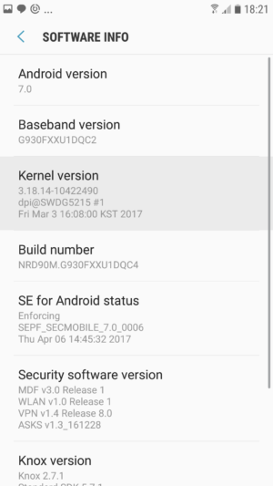

Let's find out.

## What is Linux?

- **The Linux kernel.** This is a small, but essential part of an operating system. The kernel is responsible for interfacing with a device’s hardware, providing services to the rest of the system, and performing tasks such as managing the device’s CPU and memory. The Linux kernel, like _any_ kernel, can only function as part of a wider operating system. It’s impossible to have an operating system that consists solely of a Linux kernel. Since Android is a complete operating system, we can immediately rule out classifying Android as a Linux kernel.
- **A Linux distribution, or distro**. This is an operating system that contains the Linux kernel and additional software such as utilities, libraries and a GUI, plus pre-installed applications such as web browsers, text editors, and music players. Even if this additional software was designed specifically to run on the Linux kernel, it’s _not_ part of the Linux kernel. When discussing operating systems that use the Linux kernel, the terms ‘distribution,’ ‘distro’ and ‘operating system’ are interchangeable. Since anyone can take the Linux kernel, add their own software, and create a complete operating system, there are _countless_ Linux distros currently available.
- **GNU/Linux.** The majority of Linux distributions are a combination of the Linux kernel plus GNU software, which has led some people to argue that we should all be referring to Linux distros as GNU/Linux. This is a _whole_ other debate, so to help keep things simple I’ll be using the terms ‘Linux distribution’ and ‘distro’ throughout this article – just note that there’s a strong link between the Linux kernel and GNU software.

## Why Android _is_ Linux

There’s really only one argument in favor of classifying Android as Linux, but it’s a strong one: every Android smartphone or tablet contains a Linux kernel. You can even see what version of the kernel is installed on your device, by opening its ‘Settings’ app and navigating to ‘About Device > Software info.’

However, Android isn’t _just_ the Linux kernel; it’s a fully-functioning operating system that features lots of additional libraries, a GUI, apps and much more, so when we ask “is Android Linux,” we’re actually asking “is Android a Linux _distro_?”

Since it’s impossible to even estimate how many Linux distros are out there, it’s very difficult to put together a list of rules about what makes an operating system a Linux distro.

Beyond the presence of the Linux kernel, the definition of a Linux distro is pretty open to interpretation, so in the rest of this article I’ll be discussing the arguments people most commonly put forward, when arguing against classifying Android as a Linux distribution.

## Why Android _isn’t_ Linux

### It doesn’t use the standard Linux kernel

In order to create an operating system that meets the unique needs of mobile devices, the Android team made a number of [changes](http://elinux.org/Android_Kernel_Features#List_of_kernel_features_unique_to_Android) to the Linux kernel, including the addition of specialized libraries, APIs and tools that are mostly BSD-derived or written from scratch, specifically for Android.

Since the entire argument in favor of classifying Android as a Linux distro hinges on the fact that Android uses the Linux kernel, this point might seem like it’s the end of the argument, but it’s not _that_ unusual for a Linux distro to make changes to the kernel.

The Linux kernel is released under the GNU General Public License, so anyone is free to modify its source code, which many Linux distros have done. When it comes to the question of just how drastically the Android team modified the Linux kernel, the [Embedded Linux wiki](https://www.linuxsecrets.com/elinux-wiki/Android_Kernel_Features.html) concludes that the amount of changes implemented by the Android team “is not extremely large, and is on the order of changes that are customarily made to the Linux kernel by embedded developers.”

### It doesn’t include the GNU software and libraries

If you agree that GNU software is a defining characteristic of a Linux distro, to the point where we should all be referring to Linux distros as GNU/Linux, then there’s no way that Android can be a Linux distro. Android includes very little GNU software, most notably, the Android team developed a customized C library called Bionic, rather than use the GNU C Library.

Even if you disagree that a Linux distro _has_ to include GNU software, then there’s still no denying that the absence of GNU makes Android very different from the majority of the Linux distro community.

### You cannot run Linux apps on Android – and vice versa

If you picked several different Linux distros at random, then chances are that the Linux kernel would be the only software component they have in common. In fact, Android has such little software in common with other Linux distros, that it’s impossible to run regular Linux apps on Android.

The reverse is also true: Android apps require Android-specific libraries, a runtime, plus a range of other software that’s found only in the Android OS, so by default you cannot run Android apps on any platform other than Android.

## The Differences

There’s some debate over whether Android qualifies as a “Linux distribution.” It uses the Linux kernel and other software, but it doesn’t include much of the software Linux distributions normally include.

When you boot an Android device, the Linux kernel loads just like it would on a Linux distribution. However, much of the other software is different. Android doesn’t include the GNU C Library (glibc) used on standard Linux distributions, nor does it include all of the GNU libraries you’d find on a typical Linux distribution. It also doesn’t include an X server like Xorg, so you can’t run standard graphical Linux applications.

Rather than running typical Linux applications, Android uses the Dalvik virtual machine to essentially run applications written in Java. These applications are targeted at Android devices and the application programming interfaces (APIs) Android provides rather than being targeted at Linux in general.

Android does have a shell like the one you’ll find on Linux. There’s no way to access it out-of-the-box, but you can install an app like [Android Terminal Emulator](https://play.google.com/store/apps/details?id=jackpal.androidterm) to gain access to this terminal environment.

By default, there’s not much you can do here. The terminal will still run in a restricted environment, so you can’t gain a full root shell without rooting your Android device. Many standard commands you might need aren’t available — that’s why people who root their device generally install the BusyBox application, which installs many command-line utilities. These utilities are used by applications to do things with their root access.

## Conclusion

So, circling back to our original question: Is Android a Linux distribution? Ultimately (and frustratingly) it all hinges on how you define a Linux distro. If you agree that we should all be referring to Linux distros as GNU/Linux instead of Linux, then the answer is _no_, as Android includes very little GNU software.

If you define ‘Linux distro’ as an operating system that includes the Linux kernel _and_ fulfills one or more additional criteria, then again, the answer is very likely to be _no_. Although every Android smartphone and tablet does include a Linux kernel, Android doesn’t completely fulfill any of the other characteristics commonly associated with Linux distros. For example, Android is very clearly the product of one company, it’s incompatible with regular Linux apps, and even though AOSP is open source, the version of Android you encounter on commercial devices feels considerably more closed than you’d expect from a Linux distro, thanks to the inclusion of user-facing proprietary code.

However, if your definition of a Linux distro is an operating system that’s based on the Linux kernel, then Android _is_ a Linux distro. It may be an unusual, highly-specialized distro, but it’s every bit as much a distro as Ubuntu, Fedora, Debian, and any other operating system that’s based on the Linux kernel.

So what’s your take on this? Is Android a Linux distro because it includes the Linux kernel? Or does an operating system need to meet some additional criteria, in order to qualify as a Linux distro? Let us know in the comments!
