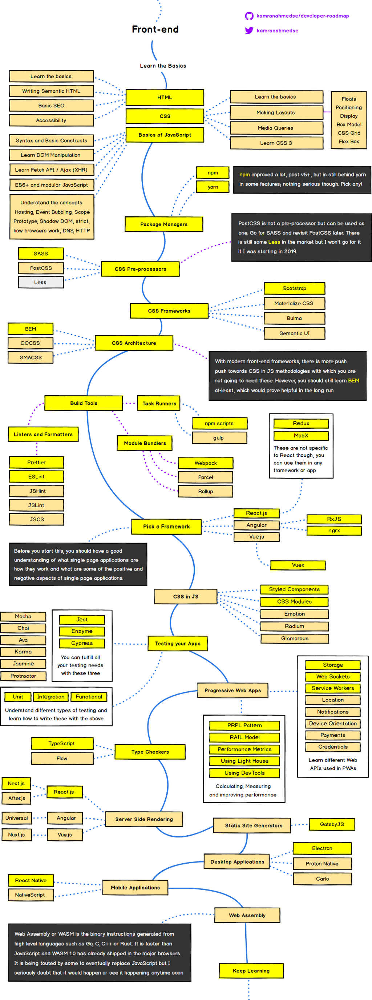
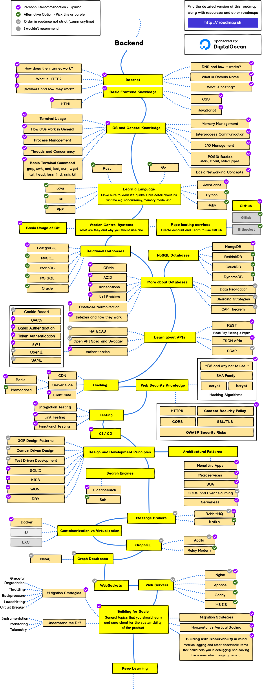
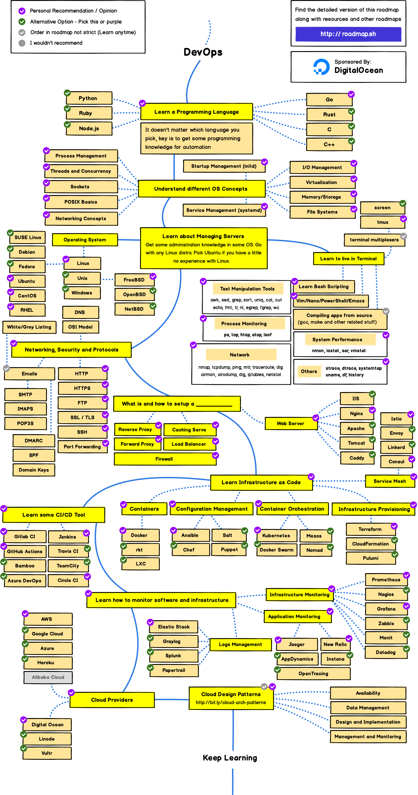

Hey guys, how are you? Are you a web development enthusiast or beginner? Then you are in the right place.

You can use this. It's slightly similar for 2020.

## **FRONT END WEB DEVELOPMENT**

**Add Headless CMS and JAMstack**

## BACK END WEB DEVELOPMENT

## DEVOPS

Images and Roadmaps Courtesy of **[RoadMap.sh](https://roadmap.sh)**
