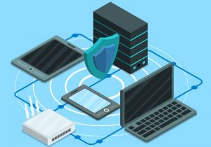

In this post, we are going to learn the **5 phases of hacking** which is used when hacking into systems. These are the phases which a typical hacker goes through in order to successfully compromise a system.

### **1\. Reconnaissance**

So the first phase of hacking is **reconnaissance.** Also known as Information Gathering. It is done to gather as much information about the target as we can.

Since all the data and information that we collect can be very useful in the later phases; this phase is perhaps the most important phase in hacking.

There are various techniques and tools used in the reconnaissance phase. Some of the tools are paid but most of them can be found for free.

_**Some examples of important information:**_

- _What is the target?_
- _How do they operate?_
- _What IP ranges do they have allocated?_
- _What do they do for mail?_
- _What do their DNS records show?_
- _What subdomains do they have?_
- _What's going on in their company?_
- _Who works there?_
- _How do they assign login names?_
- _What's their password policy?_
- _What do their networks look like?_
- _Are any of the people who work there vulnerable to social engineering?_
- _What are there valuable assets?_
- _Where do they store valuable assets?_

Further, **reconnaissance is also of two types:**

### **Passive Reconnaissance**

When doing **passive reconnaissance** we have **no direct interaction** with the target system. An example of this would be looking at the website of the target company; or checking out the job openings to know what kind of positions are available in that company.

Also, we can do a quick Google search or look up to a public record like **WHOIS** to get information about the target company’s website.

Now, none of these techniques is direct interaction with the target itself; so these techniques fall under passive reconnaissance.

The scope of what we might want to gather could include not only the systems, hosts and the servers; But it also could include the clients of the company or the target as well as the employees. We could then extract information from the employees with the help of social engineering.

By the way, if you don’t know **what social engineering is**— it is just a **technique of manipulating people** into giving some information that they would not normally give. Marketers are very good at manipulating people. They use social engineering all the time while they are marketing their products.

**Dumpster diving is another example** of reconnaissance that we can use. With dumpster diving, we can get information such as bank statements, ATM slips, phone numbers etc.

### **Active Reconnaissance**

When doing **active reconnaissance we directly engage with the target.** Since active reconnaissance involves interacting directly with the target sometimes it could be difficult. Making telephone calls directly to the target will be an absolute example of active reconnaissance.

Also, **using a ping service** to check if the target system is responding or not will also be an active reconnaissance.

Now generally, we don’t want to go for active reconnaissance. We never knew what will be on the other side. So it’s better to go for the passive way. If you are using the ping service to ping a server then you are active touching the server.

You could possibly leave your mark behind by doing that which could lead you to trouble.

_**Some examples of tools:**_

- _[theHarvester](https://github.com/laramies/theHarvester)_
- _[birdwatcher](https://github.com/michenriksen/birdwatcher)_
- _[Nmap](https://nmap.org/)_

### **2\. Scanning**

Now based on the information that we gather via our reconnaissance our **next phase is scanning.** In the scanning phase, we use different tools to gather more information about the target.

These tools include **port scanners, network mappers, ping tools, sweepers, and vulnerability scanners.** With these scanning tools, we can gather a good amount of information about the network.

As an example, we will be able to figure out what ports are opened and what ports are closed; we will also be able to get information about what operating systems are being used on the devices; what are the types of devices that are used in the network and much more.

Scanning phase is a **little bit more active** but there are some passive ways of scanning too. So if we want to figure out what type of operating systems are being used in the network, we may try sending some network traffic to those systems.

The response of all the operating systems towards the network traffic will be different. It is because of the fact that Windows computers respond to the traffic in a different way vs mac computers vs Linux computers.

An example of passive scanning would be **sniffing the network traffic.** We can use tools like Wireshark to sniff the network traffic.

The result of this phase is that we get to know the entire **network infrastructure.** We try to make sense of the data collected in this phase and the reconnaissance phase. We then convert all this data into useful information which ultimately gives us a blueprint of the entire network.

_**Some examples of tools:**_

- _[Nmap](https://nmap.org/)_
- _[Nikto](https://cirt.net/nikto2)_
- _[WPScan](https://wpscan.org/)_

### **3\. Gaining Access**

So this is the **phase were real hacking takes place.** In this phase, we try to get into the system using the vulnerabilities discovered during the scanning phase. As an attacker, we try to figure out a path for getting into the network infrastructure to take control of our hands.

We can try different methods to get **access to the inside of the network.** We can either get access via the network, via a specific operating system or via an application vulnerability.

In the gaining access phase of hacking, we can use different methods like denial of service (DOS) attack or session hijacking. We can make use of the denial of service attack on a system which sometimes exposes the hidden vulnerabilities.

We can then use those vulnerabilities to gain access to the system and complete this phase of the hacking process.

_**Some examples of tools:**_

- _[THC Hydra](https://sectools.org/tool/hydra/)_
- _[Nmap](https://nmap.org/)_
- _[Armitage](https://tools.kali.org/exploitation-tools/armitage)_
- _[Metasploit](https://github.com/rapid7/metasploit-framework)_
- _[SET (Social Engineering Toolkit)](https://github.com/trustedsec/social-engineer-toolkit)_

### **4\. Maintaining Access**

After penetrating into the network and gaining the access to a system; we now try to **maintain that access.**

Once we are into the network we would like to return to the same level of access or greater, in the future. So to do that we could implement **features such as a rootkit or a Trojan or a backdoor** that would continually provide that access in the future.

The longer we try to maintain our control over the compromised system the better it would be. We can then use the compromised system as a source to infect other devices on the network.

And some of the benefits of continuous access could be manipulating data, continuing to see what’s going on in the network over a longer period of time including more time to launch additional attacks.

_Some examples of tools:_

- _[Metasploit](https://github.com/rapid7/metasploit-framework)_
- _[Shellter](https://www.shellterproject.com/)_
- _[Webshells](http://tools.kali.org/maintaining-access/webshells)_

### **5\. Clearing Tracks**

This is the **last phase of hacking**—covering or **clearing our tracks.** The goal of this phase is to not be noticed by the IT professionals of the target network.

We try to hide anything malicious that we might have done on the system or on the network.

Because if no one notices that the attacker was there that continuing access and maintaining access is going to be that much easier. Since the attack was unnoticed and uncaught and as a result, no one’s taking additional action to prevent it from happening in the future.

Another aspect of covering one’s tracks would be to make sure that **any system logs** that are documenting activity on that system either they’re **overwritten or destroyed or modified.** This is done so that those logs do not reflect the attacker’s activities.

**Now one thing to note is that all hackers use this procedure, be it black hat hackers, grey hat hackers and white hat hackers.** **The only exception is that when the hacker already knows the target or if the hacker is a [script kiddie](https://ajulusthoughts.wordpress.com/2019/01/05/types-of-hackers-which-hat-fits-you/)**. **Post on the steps/procedure commonly used by ethical/white hat hackers coming soon.**

#### How to Protect Yourself and Your Organization in/from Each Step Coming Soon! Stay Tuned!

### [**SOURCE**](https://hackingpress.com/phases-of-hacking/)
